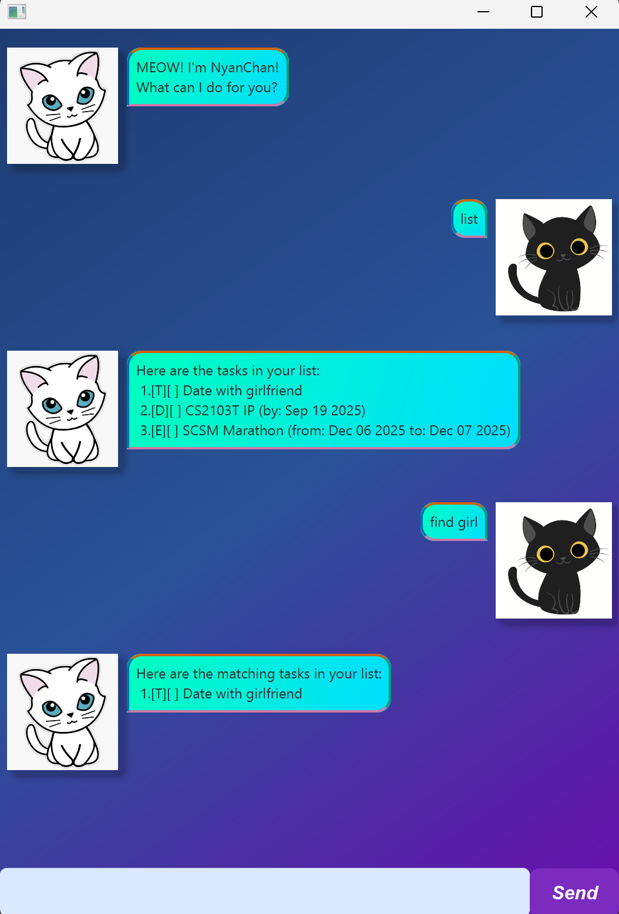

# NyanChan ChatBot User Guide



Welcome to **NyanChan**, your friendly Java-based task management chatbot! NyanChan helps you manage your tasks efficiently via simple text commands.

---

## Getting Started

1. Run the chatbot using the provided JAR file:

```bash
java -jar nyanchan.jar
```
2. Type commands in the input field to interact with NyanChan.

3. All commands are case-insensitive.

## Supported Commands
## Adding Tasks

NyanChan supports Todo, Deadline, and Event tasks.

## Todo

Adds a simple task without a date/time.

Usage:
```bash
todo <task description>
```

Example:
```bash
todo Buy groceries
```

## Deadline

Adds a task with a due date.

Usage:
```bash
deadline <task description> /by <dd/MM/yyyy>
```

Example:
```bash
deadline Submit report /by 20/09/2025
```

## Event

Adds a task that occurs over a specific time range.

Usage:
```bash
event <task description> /from <start date> /to <end date>
```

Example:
```bash
event Team meeting /from 21/09/2025 /to 21/09/2025
```

## Managing Tasks

## Mark/Unmark
Mark a task as done or not done.

Usage:
```bash
mark <task number>
unmark <task number>
```

## Delete
Remove a task from the list.

Usage:
```bash
delete <task number>
```

## List
Shows all current tasks.

Usage:
```bash
list
```

## Find
Search for tasks by keyword.

Usage:
```bash
find <keyword>
```